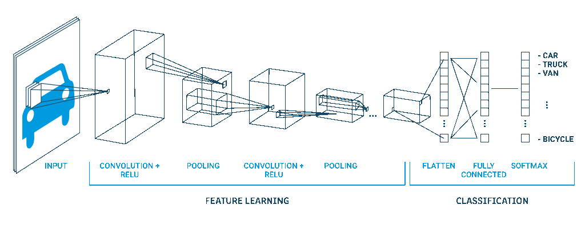

# 1. Mô tả bài toán

Nhận diện cảm xúc khuôn mặt là một bài toán trong lĩnh vực **thị giác máy tính (Computer Vision)** và **học máy (Machine Learning)**. Mục tiêu của bài toán là xác định cảm xúc của một người dựa trên hình ảnh hoặc video khuôn mặt (trong đồ án lần này sẽ tập trung vào xác định cảm xúc dựa trên hình ảnh). Đây là một bài toán có nhiều ứng dụng thực tiễn trong AI, y tế, marketing và tương tác người - máy.

## Ứng dụng của Nhận diện cảm xúc khuôn mặt

- **Giáo dục:** Phản ứng của người học trong thời gian thực và sự tham gia vào nội dung là một thước đo lường cho hiệu quả của bài giảng.
- **Tiếp thị:** Đây là một cách tuyệt vời để các công ty kinh doanh phân tích cách khách hàng phản hồi với quảng cáo, sản phẩm, bao bì và thiết kế cửa hàng của họ.
- **Chơi game:** Với sự ra đời của game thực tế ảo gần với trải nghiệm thực tế, nhận dạng cảm xúc khuôn mặt đóng một vai trò quan trọng để cải thiện trải nghiệm chơi trò chơi.
- **Bảo mật:** Nó có thể giúp xác định hành vi đáng ngờ trong đám đông và có thể được sử dụng để ngăn chặn tội phạm và những kẻ khủng bố tiềm năng.
- **Chăm sóc sức khỏe:** Nó có thể hữu ích trong việc tự động hóa dịch vụ y tế. Cả sức khỏe thể chất và tinh thần có thể được phân tích thông qua ứng dụng này.


# 2. Các tiêu chí đánh giá độ hiệu quả của mô hình

Khi đánh giá một mô hình phân loại, chúng ta thường sử dụng **ma trận nhầm lẫn (Confusion Matrix)** để xác định các chỉ số đánh giá. Giả sử mô hình phân loại nhị phân (có hai lớp: Dương tính và Âm tính), ma trận nhầm lẫn có dạng:

|                        | Dự đoán Dương tính | Dự đoán Âm tính   |
|------------------------|--------------------|--------------------|
| Thực tế Dương tính (P) | True Positive (TP) | False Negative (FN)|
| Thực tế Âm tính (N)    | False Positive (FP)| True Negative (TN) |

**Trong đó:**
- **True Positive (TP):** Số lượng mẫu thực sự dương tính và được mô hình dự đoán đúng.
- **False Positive (FP):** Số lượng mẫu thực sự âm tính nhưng bị mô hình dự đoán sai thành dương tính *(lỗi Type I)*.
- **False Negative (FN):** Số lượng mẫu thực sự dương tính nhưng bị mô hình dự đoán sai thành âm tính *(lỗi Type II)*.
- **True Negative (TN):** Số lượng mẫu thực sự âm tính và được mô hình dự đoán đúng.

---

## 2.1. Classification Accuracy

Accuracy = (TP + TN) / (TP + TN + FP + FN)

- **Accuracy** đo lường tỷ lệ dự đoán đúng trên tổng số mẫu.
- Đây là chỉ số đơn giản và dễ hiểu, phản ánh tổng thể hiệu suất mô hình.
- Tuy nhiên, Accuracy có thể gây hiểu lầm trong các bài toán có **dữ liệu mất cân đối (imbalanced dataset)**. Ví dụ, nếu 95% dữ liệu thuộc một lớp và mô hình luôn dự đoán lớp đó, Accuracy vẫn có thể cao nhưng mô hình không thực sự hiệu quả.

---

## 2.2. Precision
Precision = TP / (TP + FP)


- **Precision** đo lường tỷ lệ dự đoán đúng trong tất cả các dự đoán dương tính.
- Precision cao đồng nghĩa với việc mô hình **hiếm khi dự đoán sai dương tính**.
- Thường quan trọng khi **False Positive có ảnh hưởng lớn** (VD: chẩn đoán nhầm bệnh).

---

## 2.3. Recall

Recall = TP / (TP + FN)

- **Recall** đo lường khả năng mô hình phát hiện đúng tất cả các trường hợp dương tính.
- Quan trọng khi **False Negative có hậu quả nghiêm trọng** (VD: bỏ sót ung thư).

---

## 2.4. F1-score

F1-score = 2 × (Precision × Recall) / (Precision + Recall)

- **F1-score** là trung bình điều hòa giữa Precision và Recall.
- Dùng khi muốn **cân bằng giữa Precision và Recall**, đặc biệt trong bài toán có dữ liệu **mất cân bằng**.
- Nếu một chỉ số cao nhưng chỉ số còn lại thấp, F1-score sẽ phản ánh điều đó.

# 3. Mô hình sử dụng

# 

Đây sẽ là kiến trúc được sử dụng trong đồ án này. Đồ án sẽ không sử dụng **transfer learning** mà sẽ xây dựng một mạng **DCNN cơ bản** để giải quyết bài toán nhận diện cảm xúc khuôn mặt.

DCNN là một loại mạng nơ-ron tích chập sâu, được sử dụng rộng rãi trong lĩnh vực thị giác máy tính để xử lý và phân tích hình ảnh. DCNN là phiên bản mở rộng của mạng CNN (Convolutional Neural Network), với nhiều lớp hơn nhằm tăng cường khả năng trích xuất đặc trưng và học biểu diễn phức tạp.

Mạng này bao gồm nhiều lớp tích chập, trong đó mỗi lớp sử dụng các bộ lọc (kernels) để phát hiện các đặc trưng như cạnh, góc, kết cấu và các đặc trưng cấp cao hơn. Sau mỗi lớp tích chập thường có một hàm kích hoạt phi tuyến, phổ biến nhất là **ReLU**, giúp mô hình học được các đặc trưng phức tạp và cải thiện khả năng phân biệt giữa các đối tượng.

Ngoài ra, các lớp **pooling**, như Max Pooling, được sử dụng để giảm kích thước dữ liệu, tối ưu hóa hiệu suất tính toán và giảm hiện tượng quá khớp (overfitting). Cuối cùng, các lớp kết nối đầy đủ (**Fully Connected**) giúp chuyển đổi đặc trưng thành đầu ra phù hợp, hỗ trợ việc phân loại hoặc nhận diện.

Nhờ có độ sâu lớn với nhiều lớp, DCNN có khả năng học các biểu diễn phức tạp và đạt hiệu suất cao trong các tác vụ như phân loại ảnh, nhận diện đối tượng và xử lý hình ảnh y tế.

# 4. Phương pháp đề xuất

## 4.1. Xây dựng Dataset

- **Thư mục `data`:** Gồm 4 thư mục con mỗi thư mục sẽ có một chức năng riêng.
  
  + **Thư mục `dataset_full`:** Là tập FER-2013 bao gồm ~30000 ảnh bao gồm 7 cảm xúc của bài toán chia làm 2 thư mục `train` và `test`, mỗi thư mục sẽ có 7 thư mục con là nhãn của 7 biểu cảm.
    
  + **Thư mục `dataset_split:`** Là thư mục `dataset_full` chia lại làm 3 tập gồm `train` , `test` và `val` với tỉ lệ tương ứng là 70% , 15% , 15%. (tập `test` được sử dụng để cho ra kết quả test trên tập FER_2013)
    
  + **Thư mục `test_data:`** Là tập ảnh tự thu thập dùng để tiền xử lí và test mô hình. (tập `test_data` được sử dụng để đưa ra kết quả test dựa trên hình ảnh thu thập được)
    
  + **Thư mục `captured_images:`** Ảnh sau khi được dự đoán từ `emotion_capture` sẽ được lưu tại đây.

## 4.2. Tiền xử lí hình ảnh

Ta sẽ tiền sử lí dữ liệu thu thập được để đưa vào test với mô hình đã xây dựng.

### 4.2.1. Nhận diện khuôn mặt bằng Haar Cascade
#### Các bước xử lý:

# 

- Sử dụng phương thức `detectMultiScale()`, thuật toán sẽ quét ảnh ở nhiều tỷ lệ khác nhau để xác định vị trí khuôn mặt.
- Một số tham số quan trọng:
  - `scaleFactor=1.1`: giảm kích thước ảnh 10% sau mỗi lần quét để phát hiện khuôn mặt ở nhiều kích cỡ khác nhau.
  - `minNeighbors=5`: số lượng vùng lân cận tối thiểu cần xác nhận để quyết định có phải khuôn mặt thật hay không (giúp giảm false positive).
  - `minSize=(30, 30)`: kích thước tối thiểu của khuôn mặt cần phát hiện.

Khi khuôn mặt được nhận diện, **OpenCV** sẽ vẽ **hình chữ nhật** xung quanh khuôn mặt và hiển thị kết quả đầu ra.

### 4.2.2. Cân bằng sáng và độ tương phản bằng phương pháp Histogram Equalization và CLAHE

####  Histogram Equalization

Phương pháp **Histogram Equalization** được sử dụng để phân bố lại mức độ sáng trên toàn bộ ảnh, giúp làm rõ các chi tiết trong vùng tối hoặc sáng quá mức. OpenCV cung cấp hàm `cv2.equalizeHist()` để thực hiện việc này một cách hiệu quả.

>  Tuy nhiên, Histogram Equalization có thể gây mất chi tiết nếu độ sáng thay đổi quá mạnh trên ảnh.

####  CLAHE (Contrast Limited Adaptive Histogram Equalization)

Để khắc phục nhược điểm của Histogram Equalization, phương pháp **CLAHE** được áp dụng. CLAHE chia ảnh thành các vùng nhỏ và thực hiện cân bằng sáng riêng cho từng vùng, giúp giữ lại chi tiết ở những khu vực có độ tương phản thấp.

- **Các tham số quan trọng:**
  - `clipLimit=2.0`: giới hạn điều chỉnh độ tương phản để tránh làm sáng quá mức.
  - `tileGridSize=(8, 8)`: số lượng vùng chia nhỏ trong ảnh.

Khi áp dụng CLAHE, ảnh đầu vào trở nên rõ ràng hơn, giúp mô hình nhận diện khuôn mặt chính xác hơn trong nhiều điều kiện ánh sáng khác nhau.

#### Resize và chuẩn hóa dữ liệu

Trong quá trình tiền xử lý ảnh, việc chuẩn hóa kích thước và giá trị pixel là bước thiết yếu để đảm bảo dữ liệu đầu vào đồng nhất và phù hợp với mô hình học sâu.

####  Thay đổi kích thước ảnh

Sử dụng phương thức `cv2.resize()`, thuật toán sẽ thay đổi kích thước ảnh về một giá trị cố định, phổ biến là **48x48** pixel. Việc này giúp:
- Đảm bảo tính đồng nhất giữa các ảnh đầu vào.
- Giảm độ phức tạp tính toán.
- Giúp mạng CNN dễ dàng trích xuất đặc trưng mà không bị ảnh hưởng bởi sự chênh lệch kích thước ảnh.

#### Chuẩn hóa giá trị pixel

Sau khi resize, dữ liệu được chuẩn hóa bằng cách chia toàn bộ giá trị pixel cho 255, đưa các giá trị về khoảng **[0, 1]**. Phương pháp này giúp:
- Giảm sự chênh lệch độ sáng giữa các ảnh.
- Giúp mô hình hội tụ nhanh hơn trong quá trình huấn luyện.

Khi ảnh đã được resize và chuẩn hóa, nó có thể được đưa vào mô hình **CNN** để thực hiện **nhận diện cảm xúc** một cách hiệu quả.

## 4.3. Kiến trúc mạng DCNN

Đầu vào là tập `train` và `val` thuộc thư mục `dataset_split` trong đó :
###  Tập `train`
- Dùng để **huấn luyện mô hình**, giúp mô hình học các đặc trưng từ ảnh và tối ưu các tham số (weights).
- Các nhãn cảm xúc tương ứng giúp mô hình học cách phân loại ảnh chính xác.

###  Tập `val`
- Dùng để **đánh giá hiệu suất mô hình trong quá trình huấn luyện**.
- Giúp:
  - Phát hiện **overfitting** (mô hình học quá kỹ trên dữ liệu huấn luyện).
  - Điều chỉnh các **hyperparameters** như số epoch, learning rate, số lớp,...

### Kiến trúc mạng DCNN

Mô hình Deep Convolutional Neural Network (DCNN) được thiết kế từ đầu, không sử dụng transfer learning. Kiến trúc chi tiết như sau:

# 
####  Cấu trúc mạng

- **Lớp tích chập đầu tiên**:  
  - 64 bộ lọc (filters) kích thước 3x3  
  - Batch Normalization  
  - ELU activation

- **Lớp tích chập thứ hai**:  
  - 64 filters  
  - Batch Normalization + ELU

- **Lớp pooling đầu tiên**:  
  - Max Pooling 2x2  

- **Lớp tích chập thứ ba và thứ tư**:  
  - 128 filters mỗi lớp  
  - Batch Normalization + ELU

- **Lớp pooling thứ hai**:  
  - Max Pooling 2x2  

- **Lớp tích chập thứ năm và thứ sáu**:  
  - 256 filters mỗi lớp  
  - Batch Normalization + ELU

- **Lớp pooling thứ ba**:  
  - Max Pooling 2x2  
  - Dropout layer để tránh overfitting

#### Fully Connected Layers

- **Flatten layer**: Chuyển đổi đầu ra sang vector 1 chiều  
- **Dense layer**:  
  - 128 nơ-ron  
  - ELU activation  
  - Batch Normalization  
  - Dropout layer  

- **Lớp đầu ra**:  
  - 7 nơ-ron (tương ứng 7 cảm xúc)  
  - Softmax activation

---

#### Tối ưu hóa và huấn luyện

- **Bộ tối ưu hóa**: Adam với `learning_rate=0.001`
- **Hàm mất mát**: `categorical_crossentropy` (vì bài toán phân loại nhiều lớp)
- **Chỉ số đánh giá**: `accuracy`
- **Số epoch**: 100
- **Tập kiểm tra (validation)**: 15% ảnh từ bộ dữ liệu FER2013

---

#### Mã giả (Pseudo-code)

```python
Input: grayscale images of size 48x48
Output: emotion class (out of 7 possible classes)

initialize Sequential model

# Convolutional Layers
Add 2x Conv2D(64 filters, 3x3) + BatchNormalization + ELU
Add MaxPooling2D(2x2)
Add 2x Conv2D(128 filters, 3x3) + BatchNormalization + ELU
Add MaxPooling2D(2x2)
Add 2x Conv2D(256 filters, 3x3) + BatchNormalization + ELU
Add MaxPooling2D(2x2)
Add Dropout

# Fully-connected Layers
Flatten
Dense(128, activation='ELU')
BatchNormalization
Dropout
Dense(7, activation='softmax')  # Output layer

# Compile model
Compile(optimizer=Adam(learning_rate=0.001), 
        loss='categorical_crossentropy', 
        metrics=['accuracy'])

# Train model
model.fit(train_data, validation_data=val_data, epochs=100)

# Output trained model and validation performance

```

## 5. Thực nghiệm
Sau khi mô hình DCNN được huấn luyện, ta tiến hành đánh giá hiệu suất nhận diện cảm xúc trên **hai tập dữ liệu kiểm thử riêng biệt**:

###  5.1. Tập test từ bộ dữ liệu FER2013

- Đây là phần dữ liệu được tách riêng từ bộ FER2013, chứa 15% ảnh trong mục `test` thuộc tập ảnh chưa từng được sử dụng trong quá trình huấn luyện.
- Ảnh trong tập này đã được chuẩn hóa theo định dạng 48x48 và grayscale, tương thích trực tiếp với mô hình.
- Mục tiêu: Kiểm tra khả năng tổng quát hóa (generalization) của mô hình đối với dữ liệu chuẩn hóa từ cùng nguồn.

###  5.2. Tập ảnh thu thập thực tế bên ngoài

- Bao gồm các ảnh khuôn mặt được thu thập từ thực tế, có thể từ webcam, bộ ảnh tổng hợp hoặc do người dùng cung cấp.
- Trước khi đưa vào mô hình, ảnh được xử lý qua các bước:
  - **Face detection** (sử dụng Haar Cascade)
  - **Chuyển sang grayscale**
  - **Resize về 48x48**
  - **Chuẩn hóa giá trị pixel**

- Mục tiêu: Đánh giá độ **robust** và khả năng áp dụng thực tiễn của mô hình trong môi trường thực.

---

###  Đầu ra

- Mỗi đầu vào sẽ trả về một vector xác suất gồm 7 phần tử tương ứng với 7 cảm xúc.
- Cảm xúc có xác suất cao nhất sẽ được chọn làm nhãn dự đoán cuối cùng.
- Ví dụ:
[0.05, 0.10, 0.03, 0.60, 0.08, 0.08, 0.06] → Dự đoán: "Happy"

- Đối với tập FER2013, độ chính xác được tính bằng cách so sánh với nhãn thật.
- Với ảnh thực tế, đánh giá có thể dựa vào quan sát trực quan hoặc phản hồi từ người dùng.

---

>  Mục tiêu: Kiểm chứng tính **chính xác**, **tổng quát hóa**, và **khả năng hoạt động trong thực

## 5.3. Kết quả thực nghiệm

##  Đánh giá hiệu suất mô hình

Sau quá trình huấn luyện và kiểm thử, mô hình được đánh giá trên hai nguồn dữ liệu: **Tập dữ liệu FER2013** và **Tập dữ liệu thực tế thu thập riêng**. Các chỉ số đánh giá mô hình bao gồm Accuracy, Precision, Recall và F1-score như sau:

| Tập dữ liệu       | Accuracy | Precision | Recall  | F1-score |
|------------------|----------|-----------|---------|----------|
| FER2013          | 0.7426   | 0.7587    | 0.7426  | 0.7429   |
| Dữ liệu thực tế  | 0.5704   | 0.7297    | 0.5704  | 0.5195   |

>  Nhận xét:
-  Mô hình hoạt động tốt trên tập dữ liệu FER2013 với các chỉ số đồng đều và khá cao.
- Khi áp dụng vào dữ liệu thực tế, Precision vẫn giữ ở mức tốt nhưng Recall và F1-score bị giảm, cho thấy mô hình có xu hướng bỏ sót một số cảm xúc thực tế.
-  Điều này gợi ý rằng có thể cần thêm dữ liệu thực tế để fine-tune mô hình nhằm tăng độ tổng quát.

## 5.4. Chức năng 

### Chức năng nhận diện cảm xúc thời gian thực

Bên cạnh việc nhận diện cảm xúc từ hình ảnh tĩnh, dự án còn hỗ trợ chức năng nhận diện cảm xúc khuôn mặt trong thời gian thực qua video hoặc webcam tại file `realtime_detection.py` . Cụ thể:

- **Phát hiện khuôn mặt trực tiếp:** Sử dụng mô hình Haar Cascade của OpenCV để phát hiện nhanh khuôn mặt trên từng khung hình video.
- **Tiền xử lý tức thì:** Các khung hình được chuyển sang ảnh xám, cân bằng sáng và chuẩn hóa ngay lập tức để chuẩn bị cho việc phân loại.
- **Dự đoán cảm xúc thời gian thực:** Ảnh khuôn mặt đã xử lý được đưa vào mô hình DCNN để dự đoán cảm xúc ngay trên từng khung hình.
- **Hiển thị kết quả:** Khuôn mặt được đánh dấu khung hình kèm nhãn cảm xúc dự đoán theo thời gian thực trên màn hình.
- **Ứng dụng thực tiễn:** Tính năng này có thể được áp dụng trong các hệ thống tương tác người - máy, theo dõi phản ứng người dùng, hoặc giám sát tâm trạng trong các môi trường giáo dục, chăm sóc sức khỏe,...

Chức năng nhận diện cảm xúc thời gian thực giúp nâng cao khả năng ứng dụng của mô hình, mang lại trải nghiệm tương tác sinh động và chính xác hơn.

### Chức năng chụp ảnh và gán nhãn để làm giàu tập dữ liệu test

Dự án còn tích hợp chức năng **chụp ảnh khuôn mặt và gán nhãn cảm xúc trực tiếp**, nhằm mục đích mở rộng và làm giàu thêm tập dữ liệu test cho mô hình thông qua file `emotion_capture`. Cụ thể:

- **Chụp ảnh từ webcam hoặc camera:** Người dùng có thể chụp nhanh hình ảnh khuôn mặt trong điều kiện thực tế.
- **Gán nhãn cảm xúc thủ công:** Sau khi chụp, người dùng sẽ nhập nhãn cảm xúc tương ứng với hình ảnh để đảm bảo dữ liệu đúng và chính xác.
- **Lưu trữ có cấu trúc:** Hình ảnh và nhãn được lưu theo cấu trúc thư mục riêng biệt, phù hợp cho việc sử dụng trong huấn luyện hoặc đánh giá mô hình.
- **Tăng tính đa dạng cho tập test:** Việc bổ sung dữ liệu mới từ nhiều góc độ, điều kiện ánh sáng và biểu cảm thực tế giúp mô hình được đánh giá và cải thiện chính xác hơn.
- **Hỗ trợ quy trình huấn luyện lại:** Dữ liệu mới thu thập có thể được tích hợp để fine-tune mô hình, nâng cao hiệu quả nhận diện cảm xúc trong môi trường thực tế.

Chức năng này giúp thu thập dữ liệu một cách linh hoạt, đảm bảo mô hình không bị phụ thuộc quá nhiều vào dữ liệu gốc mà có thể thích nghi tốt với các trường hợp thực tế đa dạng hơn.

## 5.5. Cải thiện
### Những điều cần làm để cải thiện mô hình

Để nâng cao hiệu quả và độ chính xác của mô hình nhận diện cảm xúc khuôn mặt, các hướng phát triển trong tương lai gồm:

- **Làm giàu tập dữ liệu:** 
  - Xây dựng và thu thập thêm bộ dữ liệu riêng biệt với đa dạng biểu cảm, góc mặt và điều kiện ánh sáng.
  - Tự xây dựng tập train và validation phù hợp, thay vì chỉ dựa vào bộ dữ liệu FER2013, giúp mô hình phù hợp hơn với dữ liệu thực tế.
  
- **Cải thiện tiền xử lý ảnh:** 
  - Nghiên cứu thêm các kỹ thuật xử lý ảnh nâng cao như cân bằng sáng tự động, lọc nhiễu, và augmentation để dữ liệu đa dạng hơn.
  - Tối ưu các bước phát hiện và cắt khuôn mặt để giảm sai số trong giai đoạn tiền xử lý.

- **Tối ưu mô hình:** 
  - Thử nghiệm các kiến trúc mạng sâu hơn hoặc các kỹ thuật học chuyển giao (transfer learning) phù hợp.
  - Điều chỉnh tham số huấn luyện như learning rate, batch size, hoặc sử dụng kỹ thuật regularization để tránh overfitting.

- **Phát triển tính năng nhận diện thời gian thực:** 
  - Tăng độ ổn định và tốc độ xử lý để ứng dụng thực tế hiệu quả hơn.

Việc thực hiện các bước này sẽ giúp mô hình đạt hiệu suất cao hơn và ứng dụng rộng rãi trong thực tế.

# 6. Tổng kết
## Tổng kết dự án

Bài toán nhận diện cảm xúc khuôn mặt là một thách thức quan trọng trong lĩnh vực thị giác máy tính với nhiều ứng dụng thực tiễn trong giáo dục, y tế, tiếp thị và bảo mật. Trong dự án này, chúng tôi đã xây dựng một mô hình Deep Convolutional Neural Network (DCNN) từ đầu, sử dụng dữ liệu ảnh khuôn mặt được tiền xử lý kỹ càng (chuyển sang ảnh xám, cân bằng sáng, chuẩn hóa kích thước) để nhận diện chính xác 7 cảm xúc khác nhau. Mô hình được huấn luyện và đánh giá trên cả dữ liệu thực tế và bộ dữ liệu chuẩn FER2013, đạt được kết quả khả quan với độ chính xác và F1-score ổn định.

Ngoài ra, hệ thống còn hỗ trợ nhận diện cảm xúc thời gian thực qua webcam và có tính năng chụp ảnh gán nhãn nhằm làm giàu tập dữ liệu test, giúp nâng cao hiệu quả mô hình trong ứng dụng thực tế. Mặc dù kết quả đã tốt, dự án vẫn còn nhiều tiềm năng cải thiện như mở rộng tập dữ liệu, nâng cao bước tiền xử lý và thử nghiệm các kiến trúc mạng sâu hơn để tăng độ chính xác và khả năng tổng quát của mô hình.


